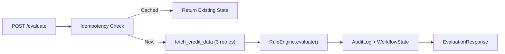

# Walkthrough — Configurable Workflow Decision Platform

## Files Created

| File | Purpose |
|---|---|
| [requirements.txt](file:///c:/Users/swara/.anaconda/Scoreme/requirements.txt) | Dependencies: fastapi, uvicorn, pydantic |
| [config.json](file:///c:/Users/swara/.anaconda/Scoreme/config.json) | Configurable rule set (income/credit thresholds + branching) |
| [database.py](file:///c:/Users/swara/.anaconda/Scoreme/database.py) | SQLite with [WorkflowState](file:///c:/Users/swara/.anaconda/Scoreme/models.py#24-30) + [AuditLog](file:///c:/Users/swara/.anaconda/Scoreme/models.py#32-40) tables |
| [models.py](file:///c:/Users/swara/.anaconda/Scoreme/models.py) | Pydantic schemas for request/response |
| [external_api.py](file:///c:/Users/swara/.anaconda/Scoreme/external_api.py) | Mock credit API — 1s latency, 30% failure rate |
| [engine.py](file:///c:/Users/swara/.anaconda/Scoreme/engine.py) | OOP Rule Engine ([Rule](file:///c:/Users/swara/.anaconda/Scoreme/engine.py#32-44) ABC → [ThresholdRule](file:///c:/Users/swara/.anaconda/Scoreme/engine.py#49-82) → [RuleEngine](file:///c:/Users/swara/.anaconda/Scoreme/engine.py#105-191)) |
| [main.py](file:///c:/Users/swara/.anaconda/Scoreme/main.py) | FastAPI app with `POST /evaluate`, idempotency, retry logic |

## Architecture



## Verification Results

All 3 tests passed on a live server (`python -m uvicorn main:app --port 8000`):

| Test | Input | Decision | Key Detail |
|---|---|---|---|
| ✅ Approval | `income=60000, score=750` | `approve` | Excellent credit score |
| ✅ Idempotency | Same APP-001 again | `approve` | `is_cached: true`, no engine re-run |
| ✅ Rejection | `income=15000, score=400` | `reject` | Income below minimum threshold |

## How to Run

```bash
cd c:\Users\swara\.anaconda\Scoreme
pip install -r requirements.txt
python -m uvicorn main:app --port 8000
```

## Next Step

You mentioned you'll provide the exact [config.json](file:///c:/Users/swara/.anaconda/Scoreme/config.json) rule structure — just drop it in and the engine will pick it up on next restart.
